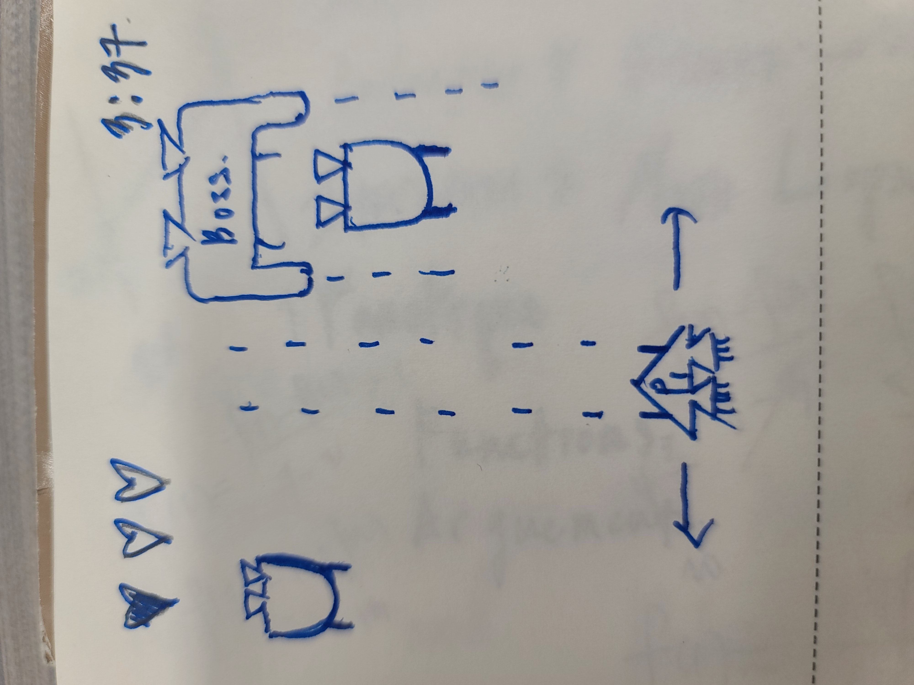

:warning: Everything between << >> needs to be replaced (remove << >> after replacing)

# << SPACE WAR >>
## CS110 Final Project  << Fall, 2023 >>

## Team Members

<< Jae Woo Song, Sacchit Agavane >>

***

## Project Description

<< A game which the spaceship has to survive as long as it can.
The spaceship is manipulated by the player's mouse or keyboard.
There is going to be laser beams shot from other ships to destroy the player's spaceship.

The idea is that we are trying to make a spaceship which can only moves left and right. the enemy spaceships will pop up randomly and the user have to hit the enemy within a certain time limit. At the end the score will be displayed. >>

***    

## GUI Design

### Initial Design

### Final Design

## Program Design

### Features

1. start game
2. quit game
3. move with keyboard
4. destroyed when hit
5. counts time
6. shoots laser when key is pressed

### Classes

- << You should have a list of each of your classes with a description >>

## ATP

