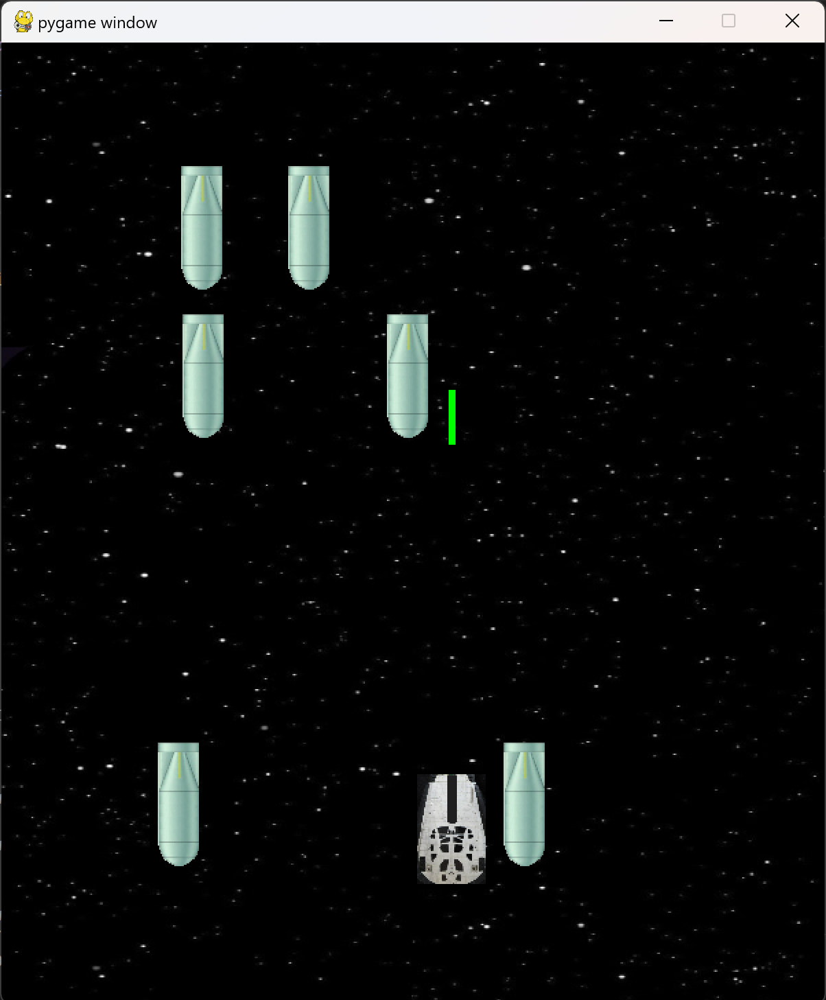

:warning: Everything between << >> needs to be replaced (remove << >> after replacing)

# << SPACEWAR >>
## CS110 Final Project  << Fall, 2023 >>

## Team Members

<< Jae Woo Song, Sacchit Agavane >>

***

## Project Description

<< A game which the player's spaceship has to survive as long as it can.

There are going to be killerships that try to destroy the player's ship by crashing.

As time goes by it gets harder and harder, though the player will get abilities from the abilitybox. >>

***    

## GUI Design

### Initial Design

### Final Design

## Program Design

### Features

1. Start game

2. Move with keyboard

3. Destroyed when hit by killership

4. As time goes by, 2 ability boxes appear when needed

5. When colliding with the first abilitybox, player gets laser or shield or speed ability.

6. When colliding with the second abilitybox, player could get either the stronger version of their 
   first ability or get a second ability while maintaining the first ability.

7. Counts how much time the player survived

8. Quit game

### Classes

- << 
class Player : Creates the player object. Arguments contain x,y,width,height,image_path
class Enemy : Creates the enemy object. Arguments contain x,y,width,height,image_path
class Laserbeam : Creates the laserbeam object. Arguments contain width, height, pos_x, pos_y, laserbeam_color
class Abilitybox : Creates the abilitybox object. Arguments contain x, y, width, height
class Controller : Contains three loops. Menuloop, Gameloop, Gameoverloop. 
     >>

## ATP
Program: "SPACEWAR"

Test Case 1: Starting Game/
Test Description: Test the navigation through the game's main menu./
Test Steps:
1.	Press the SPACEBAR key to Start the game.
2.	Verify that this action is working and leads to the expected actions.
Expected Outcome: The main menu should allow the player to start the game when SPACEBAR key is pressed.

Test Case 2: Sound Condition/
Test Description: Verify that the background music and the sound effects are properly working./
Test Steps:
1.	Run the program.
2.	Verify if the background music is working.
3.	Start the game.
4.  Verify if the starting game sound is working.
5.  Play the game.
6.  Verify if the sound effects are working when collision happens or when shooting laserbeams.
Expected Outcome: Sound effects should work while playing.

Test Case 3: Image Visibility/
Test Description: Verify that the game has the assigned images./
Test Steps:
1.	Start the game.
2.	Verify that the program has the assigned background image.
3.	Verify that the program has the assigned player spaceship image.
4.	Verify that the program has the assigned enemy spaceship image.
5.  Verify that the program has the assigned abilitybox image.
Expected Outcome: The program have the correct assigned image.

Test Case 4: Player Movement/
Test Description: The Player’s ship moves left/right/up/down when left/right/up/down arrow keys are pressed./
Test Steps:
1.	Start the game.
2.	Press the left arrow key.
3.	Verify that the player’s spaceship moves left.
4.	Press the right arrow key.
5.	Verify that the player’s spaceship moves right.
6.	Press the up arrow key.
7.	Verify that the player’s spaceship moves up.
8.	Press the down arrow key.
9.	Verify that the player’s spaceship moves down.
Expected Outcome: The player’s spaceship should move left/right/up/down in response to the arrow key inputs.

Test Case 5: Abilitybox Collision Detection/
Test Description: Ensure that collisions between the player and abilityboxes are detected correctly./
Test Steps:
1.	Start the game.
2.	Survive until the abilitybox comes down.
3.	Verify when collided with a abilitybox gets a ability.
Expected Outcome: Player gets a ability when collided with a abilitybox.

Test Case 6: Game Over Condition/
Test Description: Ensure that collisions between the player's ship and enemy ships are detected correctly./
Test Steps:
1.	Start the game.
2.	If the player's spaceship collides with an enemy ship.
3.	Verify that the game ends.
4.	If the player's spaceship avoids contact the enemy ship.
5.	Verify that game does not end.
Expected Outcome: If player’s spaceship avoids encountering enemy ships the game should go on.

Test Case 7: Returning back to Menu from Game Over/
Test Description: Ensure that when game is over if player presses space, player goes back to the menu/
Test Steps:
1.	Start the game.
2.	Play till the playership collides with the enemy.
3.	Go to the gameover screen.
4.	Verify if pressed space from gameover screen, player can get to menu screen.
Expected Outcome: If pressed space from gameover screen, player gets to menu screen.

